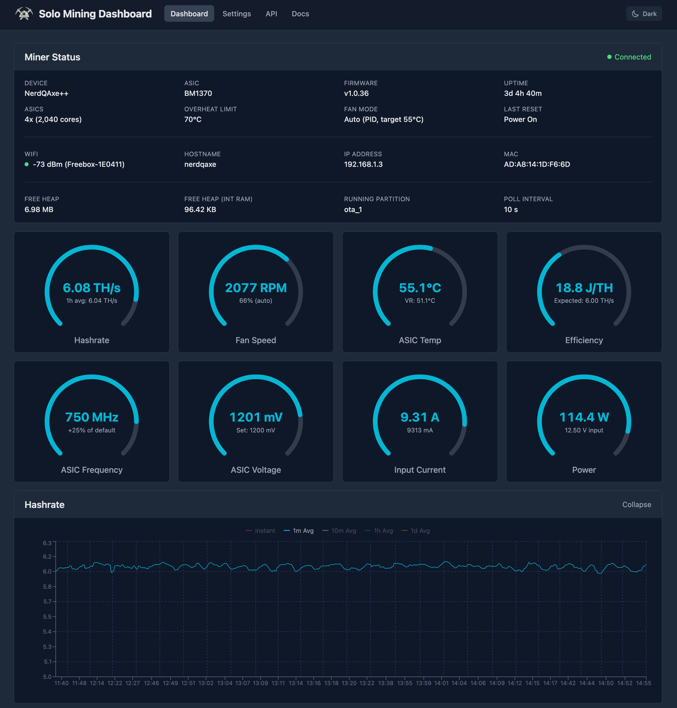
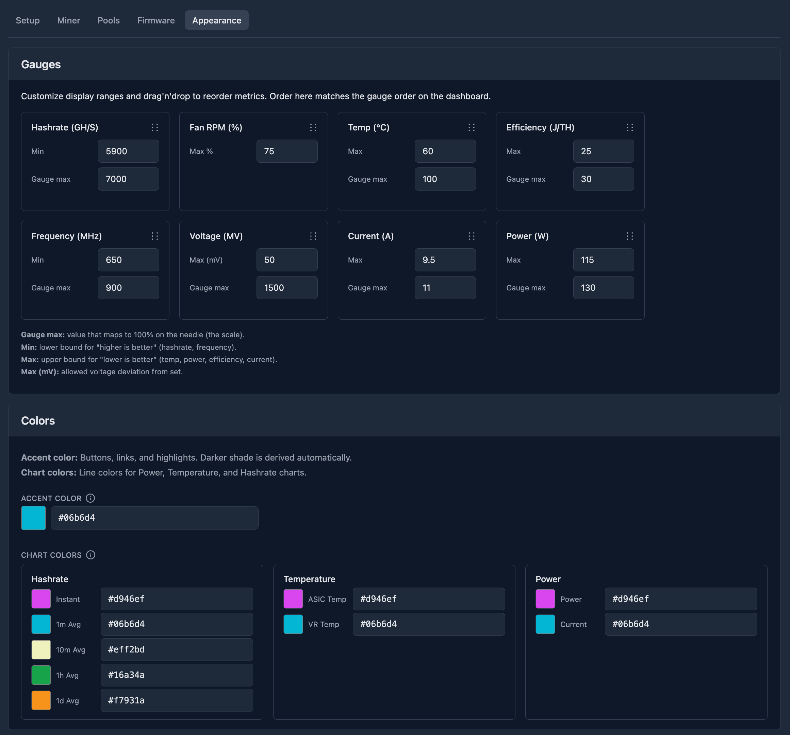
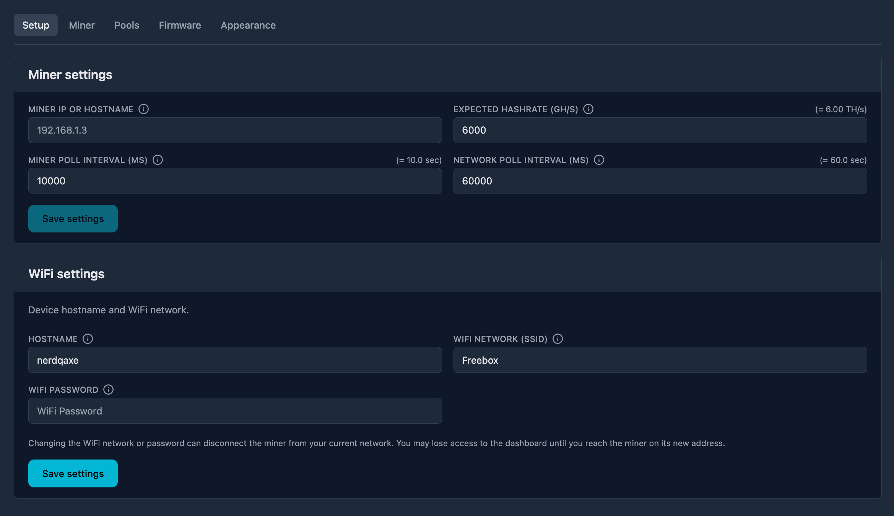
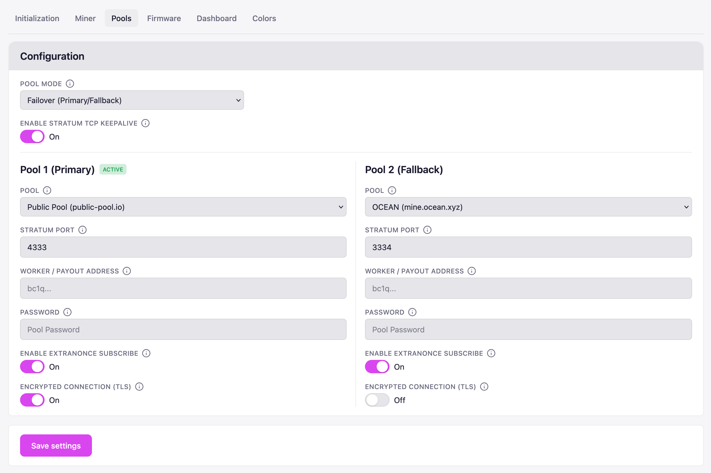
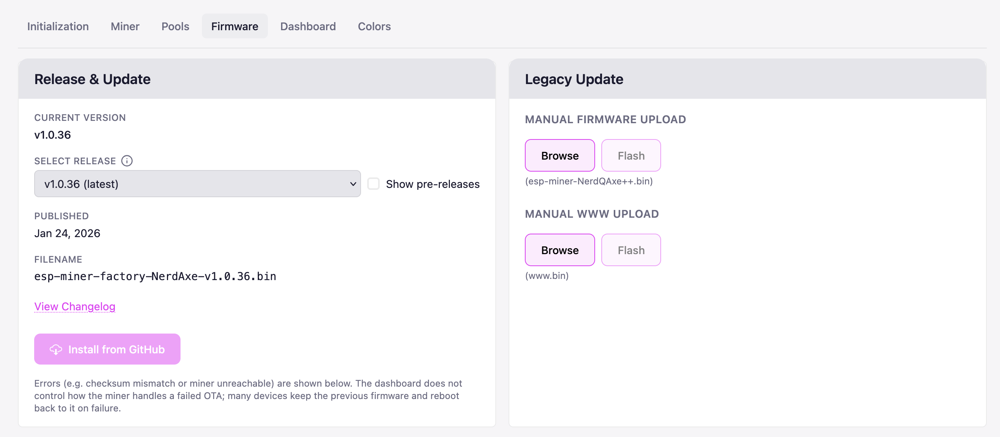

# Miner Dashboard

A real-time monitoring dashboard for the NerdQaxe++ Bitcoin Solo Miner, or similar devices.

## Features

- **Monitoring:** live miner metrics, hashrate, temp, power, fan speed; history charts; shares and pool info; network difficulty and more
- **Fully Customizable:** adjust colors for accents, charts, gauges, and drag'n'drop to reorder gauges on the dashboard
- **Network Context:** observe public network metrics via mempool.space
- **API Monitoring:** check live API calls and results
- **Pool Config:** made easy with useful presets and robust validation
- **Firmware Updates:** with checksum verification to protect hardware
- **Self-hosted:** runs on your machine; miner and dashboard data stay on your network

## Compatible devices

The dashboard talks to the miner over the **ESP-Miner** / AxeOS API (`/api/system/info`, etc.). ESP-Miner is open-source ESP32 firmware for the Bitaxe, NerdQaxe, and similar Bitcoin ASIC miners; devices running it (or AxeOS on top of it) expose the same web API. Compatible devices include:

| Device        | Notes                          |
|---------------|--------------------------------|
| **Bitaxe**    | Single BM1370, ~1 TH/s         |
| **NerdQaxe+** | 4× BM1368, 2.4 TH/s            |
| **NerdQaxe++**| 4× BM1370, 4.8 TH/s            |
| **Qaxe**      | 4× BM1366, ~1.8 TH/s           |
| **QAxe+**     | 4× BM1368, 2.4 TH/s            |

Other devices that expose the same web API are likely compatible as well.

## Quick Start

```bash
# Install dependencies
npm install
cd client && npm install && cd ..

# Copy env template (optional: set MINER_IP in .env or later in Dashboard Settings)
cp .env.example .env

# Run in development mode
npm run dev
```

This starts:
- Express backend on `http://localhost:8001`
- Vite dev server on `http://localhost:8000` (with proxy to backend)

Open `http://localhost:8000` in your browser.



## Tech stack

- **Backend:** Express (Node.js), proxies miner API and serves config; fetches Bitcoin data from mempool.space and (optionally) GitHub for firmware releases
- **Frontend:** React 19, Vite, Tailwind CSS, Recharts

## Production

```bash
# Build frontend
npm run build

# Start production server
npm start
```

Then open `http://localhost:8001`.

## Configuration

**Environment variables (optional):** 
- Copy `.env.example` to `.env`. 
- `MINER_IP` can be set here or in **Settings**; `.env` overrides the value stored in the config file. 
- For **Settings → Firmware** (fetching releases from GitHub), you can set an optional token in `.env` to avoid rate limits — see `.env.example`.

**Dashboard config:** (server-persisted, stored in `config/dashboard.json`):

- **Setup tab:** Miner IP or hostname, Expected hashrate (GH/s), Miner / Network poll intervals (ms). WiFi (hostname, SSID, password).
- **Dashboard tab:** Metric ranges — single threshold and gauge max per metric.

## Troubleshooting

- **Miner not reachable:** Ensure `MINER_IP` (or the value in Settings) is correct and the miner is on the same network. The server log prints the current miner API target on startup.
- **Firmware releases not loading:** If you hit GitHub API rate limits, set the optional token in `.env` as described in `.env.example`.

## Commands

| Command | Description |
|---------|-------------|
| `npm run dev` | Run backend and frontend in development (watch mode) |
| `npm run dev:server` | Run Express backend with `--watch` |
| `npm run dev:client` | Run Vite dev server (client) |
| `npm run build` | Build frontend for production |
| `npm start` | Start production server (run after `npm run build`) |
| `npm run lint` | Lint client code (use `--fix` to auto-sort imports to the project order) |
| `npm run test` | Run client tests |
| `npm run test:watch` | Run client tests in watch mode |
| `npm run all` | Run build, test, and lint concurrently |

## Screenshots

| Dashboard | Settings – Miner | Settings – Appearance |
|-----------|------------------|------------------------|
|  |  |  |

| Settings – Setup | Settings – Pools | Settings – Firmware |
|------------------|------------------|---------------------|
|  |  |  |

## License

[MIT](LICENSE)

## Contribute

[Contributing](CONTRIBUTE.md)
