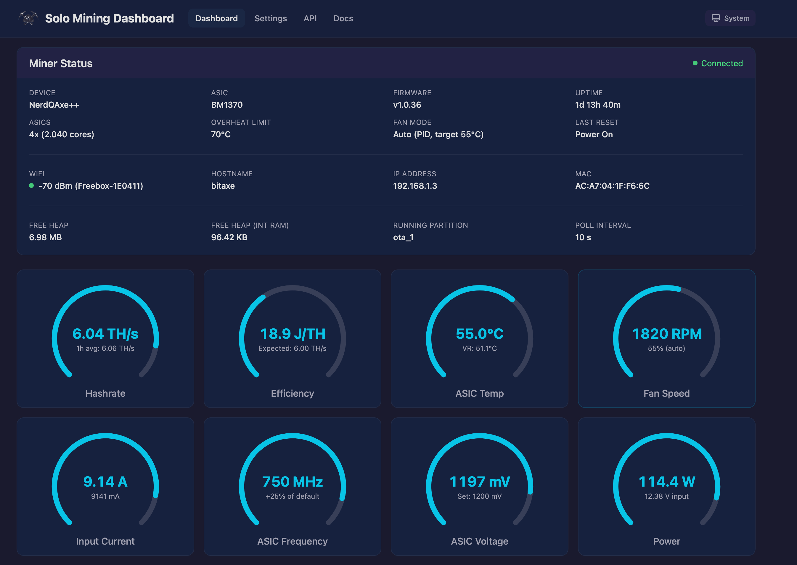
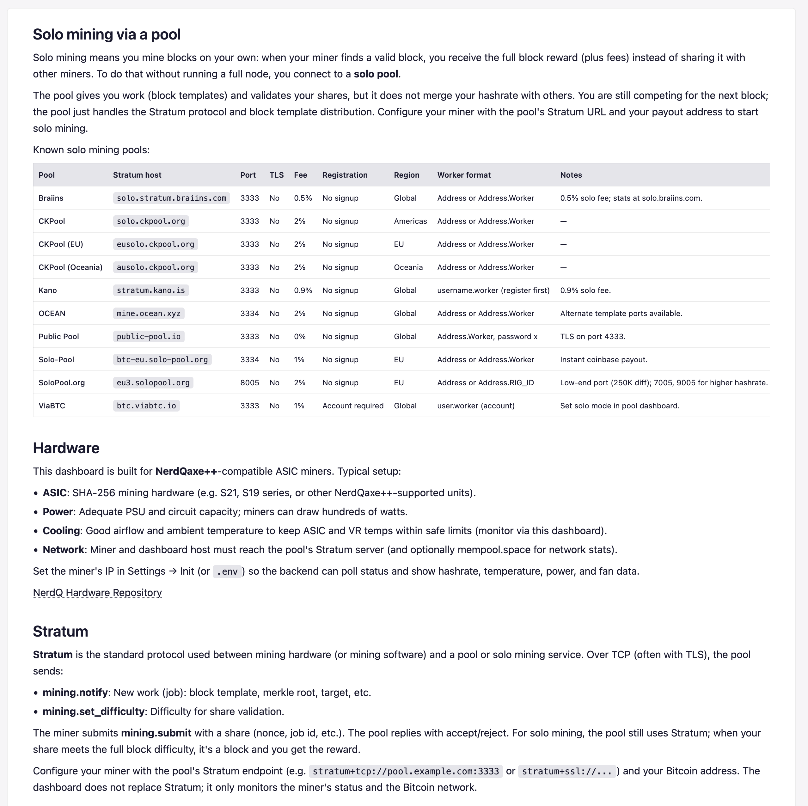
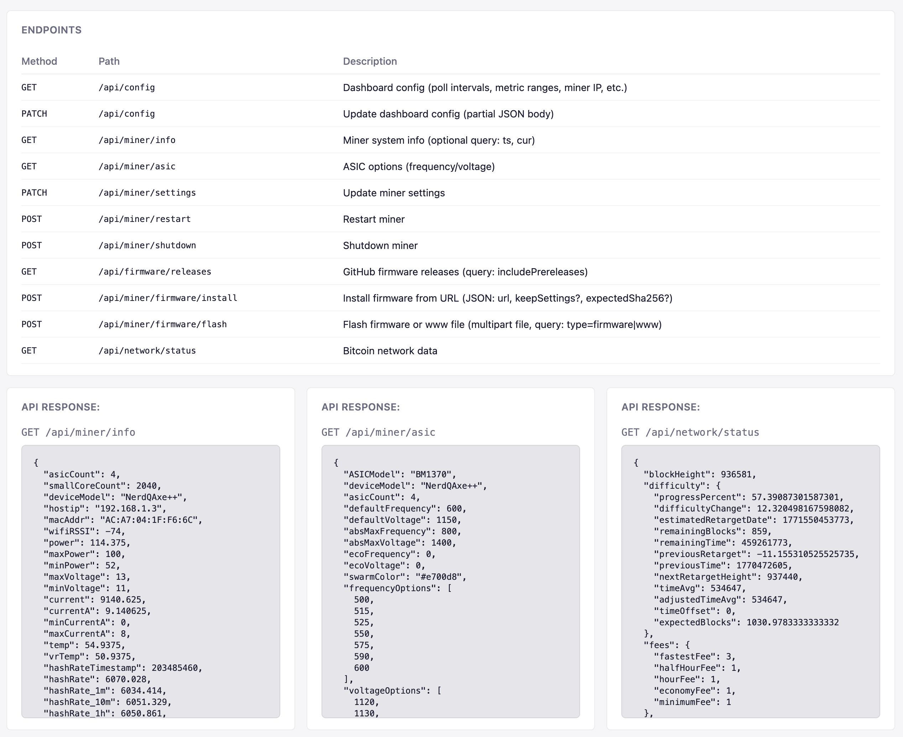
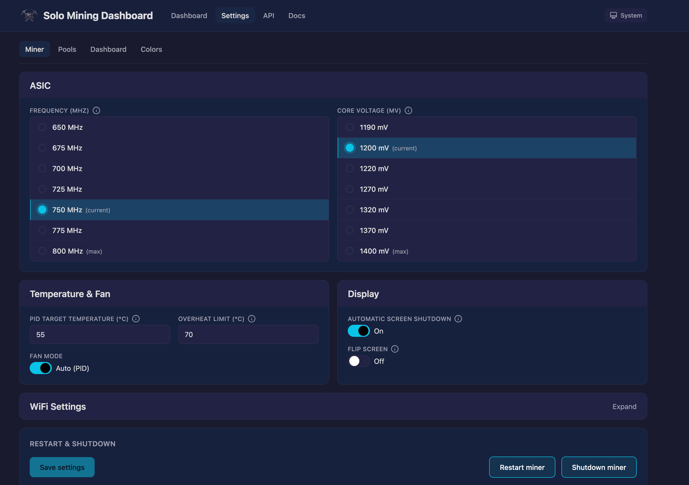
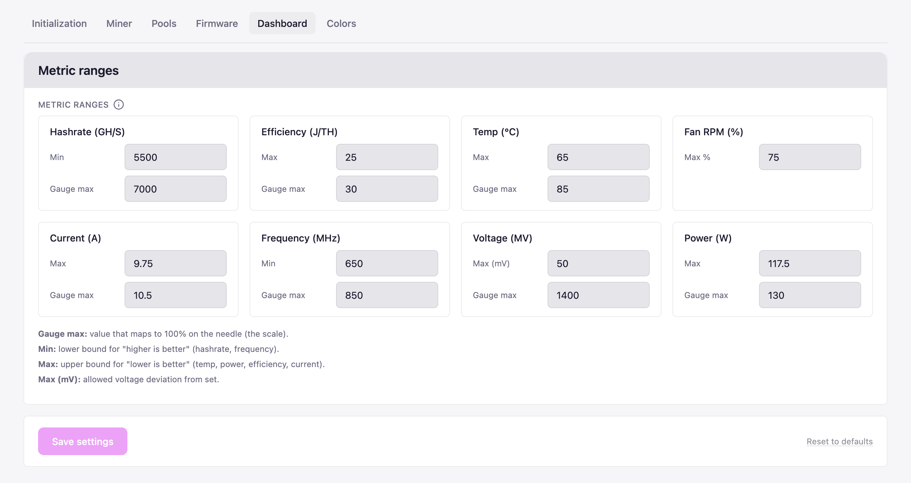
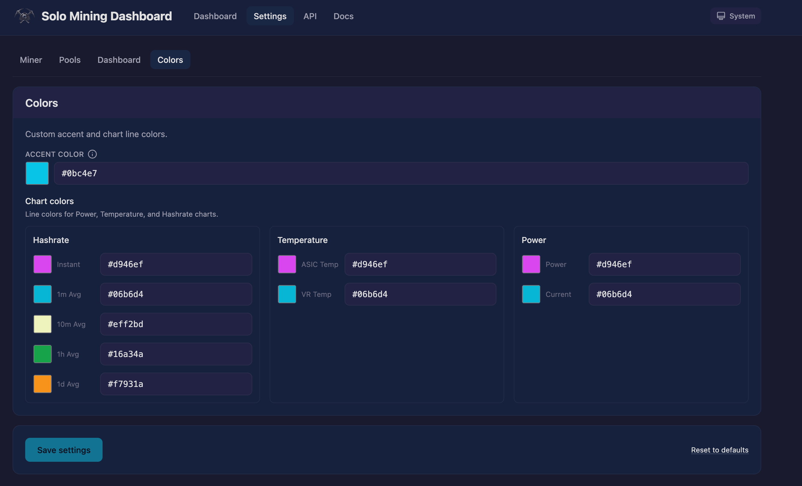

# Miner Dashboard

A real-time monitoring dashboard for the NerdQaxe++ Bitcoin Solo Miner, or similar devices. This document covers setup and general reference; see [Contributing](CONTRIBUTE.md) for development.

## Features

- **Live miner monitoring**: hashrate, temperature, power, fan speed (10s polling)
- **Charts**: hashrate and temperature/power history (rolling 1h buffer)
- **Mining details**: shares accepted/rejected, best difficulty, pool info
- **Bitcoin network**: block height, difficulty adjustment, BTC price, fee estimates (60s polling)
- **Settings – Setup**: first-time setup — miner IP/hostname, expected hashrate (GH/s), poll intervals; WiFi (hostname, SSID, password) stored on the miner
- **Settings – Miner**: configure miner IP/hostname and connection
- **Settings – Pools**: view and manage pool configuration (URL, worker, password)
- **Settings – Firmware**: check firmware releases and install updates (via URL or file upload)
- **Settings – Dashboard**: expected hashrate, poll intervals, and metric ranges (thresholds and gauge max for hashrate, temp, power, efficiency, etc.)
- **Settings – Colors**: customize accent color and gauge/indicator colors; settings persisted to the server

## Requirements

- **Node.js** 18 or later
- A NerdQaxe++ miner on your network (for live monitoring)

## Quick Start

```bash
# Install dependencies
npm install
cd client && npm install && cd ..

# Copy env template (optional: set MINER_IP in .env or later in Dashboard Settings)
cp .env.example .env

# Run in development mode
npm run dev
```

This starts:
- Express backend on `http://localhost:8001`
- Vite dev server on `http://localhost:8000` (with proxy to backend)

Open `http://localhost:8000` in your browser.



## Tech stack

- **Backend:** Express (Node.js), proxies miner API and serves config; fetches Bitcoin data from mempool.space and (optionally) GitHub for firmware releases
- **Frontend:** React 19, Vite, Tailwind CSS, Recharts

## Production

```bash
# Build frontend
npm run build

# Start production server
npm start
```

Then open `http://localhost:8001`.

## Configuration

**Environment variables (optional):** 
- Copy `.env.example` to `.env`. 
- `MINER_IP` can be set here or in **Settings**; `.env` overrides the value stored in the config file. 
- For **Settings → Firmware** (fetching releases from GitHub), you can set an optional token in `.env` to avoid rate limits — see `.env.example`.

**Dashboard config:** (server-persisted, stored in `config/dashboard.json`):

- **Setup tab:** Miner IP or hostname, Expected hashrate (GH/s), Miner / Network poll intervals (ms). WiFi (hostname, SSID, password).
- **Dashboard tab:** Metric ranges — single threshold and gauge max per metric.

**Config API:** `GET /api/config` returns the current config; `PATCH /api/config` updates it. Used by the Settings UI.

The backend listens on port 8001 (see `server/config.js` to change).

## Troubleshooting

- **Miner not reachable:** Ensure `MINER_IP` (or the value in Settings) is correct and the miner is on the same network. The server log prints the current miner API target on startup.
- **Firmware releases not loading:** If you hit GitHub API rate limits, set the optional token in `.env` as described in `.env.example`.

## Commands

| Command | Description |
|---------|-------------|
| `npm run dev` | Run backend and frontend in development (watch mode) |
| `npm run dev:server` | Run Express backend with `--watch` |
| `npm run dev:client` | Run Vite dev server (client) |
| `npm run build` | Build frontend for production |
| `npm start` | Start production server (run after `npm run build`) |
| `npm run lint` | Lint client code (use `--fix` to auto-sort imports to the project order) |
| `npm run test` | Run client tests |
| `npm run test:watch` | Run client tests in watch mode |
| `npm run all` | Run build, test, and lint concurrently |

## Architecture

```
Browser --> Express (port 8001) --> NerdQaxe++ Miner (192.168.1.3)
                                --> mempool.space API
```

The Express backend proxies requests to the miner (avoiding CORS issues) and aggregates Bitcoin network data from mempool.space with 30s caching.

## More screenshots

| Dashboard (light) | Docs |
|-------------------|------|
|  |  |

**API**




| Setup | Miner | Pools |
|------|-------|-------|
|  |  |  |


| Miner (dark) | Pools (dark) |
|--------------|--------------|
|  |  |


| Dashboard | Firmware | Colors |
|-----------|----------|--------|
|  |  |  |


| Dashboard (dark) | Colors (dark) |
|------------------|---------------|
|  |  |

## License

[MIT](LICENSE)

## Contribute

[Contributing](CONTRIBUTE.md)
